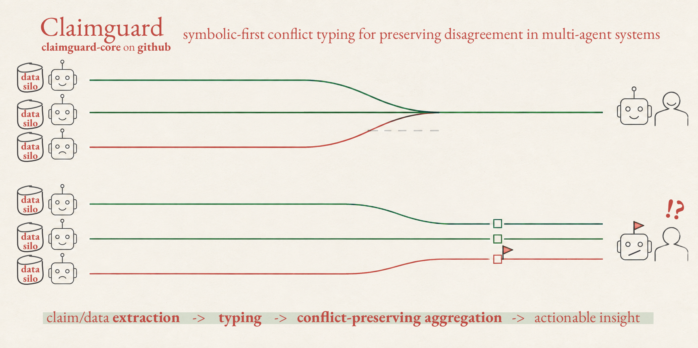

# claimguard - symbolic-first conflict typing for preserving disagreement in multi-agent systems



tl;dr - It’s a deterministic gate that types every disagreement, labels every conflict with the mechanism that found it and escalates only the ones someone can act on. Agents that disagree becomes a checkable, informative fact. Highlights: §'Deterministic first, model second', the abstention taxonomy ('Layer 1') &c. This is useful in agentic systems with these conditions: 1) multiple parties hold documents they won't/can't pool, 2) comparable facts are stated in each, 3) disagreement is consequential, as in regulated settings or when something acts on the answer downstream, 4) silent wrongness costs more than slowness. Domain uses: 

**1. clinical/bioNLP**:
- multi-site trial protocol reconciliation (the demo case in this repo)
- guideline conflicts (national vs trust vs departmental SOP)
- systematic review extraction where N papers report the same outcome differently
- pharmacovigilance 

**2. legal tech**:  
- contract review across counterparties (see e.g. `notice_period` in the demo)
- due diligence across data rooms
- conflicting clauses on governing law or liability caps
- regulatory compliance where policy / regulation / local procedure disagree

**3. enterprise settings e.g. fintech, security 🤔**: 
- multi-vendor security attestations
- standards conformance across implementations
- financial reconciliation between subsidiaries 


**Disagreement safety for multi-agent systems.** When agents fan out and something
merges their findings, the merge deletes disagreement among agents and conflicts in the retrieved information — one step before the only
human checkpoint. This replaces the merge step, and a reviewer can verify every
finding without anyone handing over their documents. Agent disagreement and conflicted information can now become informative for human decision. 

> **_NOTE:_**  1. This work was designed at the [Collaborative Agent Hackathon](https://discuss.flower.ai/t/collaborative-agent-hackathon-cambridge-uk-2026/1269) hosted by the federated learning framework [flower.ai](https://flower.ai/) on August 26, 2026 in Cambridge, UK, 2026. The core logics (claimguard.py, aggregate.py & nli.py) are modular & can be adapted for use with different models (MNLI models, LLM for prose extraction, agents) & input data.
> 2. The full hackathon implementation for this in a Flower Agent [claimguard](https://flower.ai/apps/amargandhi/claimguard-agent) by our team ('Dissensus') was completed by my teammate [Amar Gandhi](https://github.com/amargandhi) – the repo for it is here: [Silo-Safe][=(https://github.com/amargandhi/silo-safe).

---

## The problem is a type signature, not a bug

Vote, summarise, concatenate-and-ask-a-model: every merge is a function from a
**set** of values to **one** value. Lossy by construction as a set of values is compressed to one value. Give the baseline
every advantage — all sources, majority vote — and it is still exactly wrong
where it matters:

```
                              merge step      claimguard
──────────────────────────────────────────────────────────
answers emitted                        8               —
competing values deleted               6               0
conflicts detected                     0               7
  escalated to a human                 —               6
  logged, not surfaced                 —               1
abstentions kept visible               —               2
false conflicts raised                 0               0
```
Reproduce it with `table.py`: `make table NLI=local` (`make table` alone runs Layer 1 only —
the model's two cases move from `conflicts` to `abstentions`, and nothing
becomes wrong). 

The merge is right on the two referents where sources agree. It still deletes
all four load-bearing disagreements. No such function can do otherwise.

---

## A reviewer can verify a finding

This is the part that matters for federated review, and it is one command.

The aggregator holds a pointer and **cannot read it** — it has no documents.
Each site resolves its own and nobody else's:

```console
$ python silo.py --site site-b --resolve claims/escalations.jsonl --check documents_hard
site-b resolving its own pointers:
  concurrent_anticoagulant
    pointer  protocol_v7:814-863
    resolves 'Concurrent anticoagulant therapy is not permitted'

$ python silo.py --site site-c --resolve claims/escalations.jsonl --check documents_hard
site-c resolving its own pointers:
  concurrent_anticoagulant
    pointer  handbook:649-694
    resolves 'Concurrent anticoagulant therapy is permitted'

$ python silo.py --site site-a --resolve claims/escalations.jsonl --check documents_hard
site-a resolving its own pointers:
  (no spans belong to this site)
```

**No machine in this system ever held both documents.** Site-a is not in the
conflict and learns nothing about it. The reviewer sees both sides because
they are the human the escalation was raised for.

`silo.py --check` verifies every pointer resolves **at the silo, before
sending** — the aggregator has no documents and cannot check a locator, so the
silo is the last place anyone can. A pointer that does not resolve is a
fabricated citation, and it refuses to emit.

---

## Deterministic first, model second

Every cross-silo pair becomes a typed edge carrying a relation
(`CORROBORATES` / `CONFLICTS` / `UNDECIDED` / `INDEPENDENT`) and — the
load-bearing part — a **basis** naming which layer decided and how:
`structural:numeric`, `structural:date`, `structural:enum`,
`structural:boolean`, `structural:negation`, `structural:unit-mismatch`,
`structural:type-mismatch`, `structural:unparsed`, `structural:text`, `nli`,
`nli:low-confidence`. A bare "they conflict" is an opinion;
`conflicts [structural:date]` is a checkable fact that needed no model, and
`undecided [structural:unit-mismatch]` tells you the system declined rather
than agreed.

```
$ make table NLI=local ARGS=--edges

VERDICT: HOLD | 12 relations | 7 conflicts, 6 escalated | 2 abstentions

concurrent_anticoagulant   a/b  CONFLICTS    [structural:negation]       same referent, opposite polarity
concurrent_anticoagulant   a/c  CORROBORATES [structural:boolean]        permitted vs permitted
concurrent_anticoagulant   b/c  CONFLICTS    [structural:negation]       same referent, opposite polarity
escalation_authority       a/b  CONFLICTS    [nli]                       contradiction
escalation_authority       a/c  CORROBORATES [nli]                       entailment
escalation_authority       b/c  CONFLICTS    [nli]                       contradiction
monitoring_interval        a/b  CONFLICTS    [structural:numeric]        4.0 vs 6.0
monitoring_interval        a/c  UNDECIDED    [structural:unit-mismatch]  'hour' vs 'minute' - normalise before comparing
monitoring_interval        b/c  UNDECIDED    [structural:unit-mismatch]  'hour' vs 'minute' - normalise before comparing
nurse_ratio_day            a/b  CORROBORATES [structural:enum]           1:6 vs 1:6
protocol_effective_date    a/c  CONFLICTS    [structural:date]           2026-01-15 vs 2026-03-01
specimen_storage_category  a/c  CONFLICTS    [structural:enum]           refrigerated vs frozen
```

Using the example corpus of claims (demo case: retrieved documents concerning observation protocols across hospitals), nine of the twelve were decided with no model. The three `escalation_authority`
rows are the model's entire contribution, and the two `monitoring_interval`
abstentions are the gate declining on `4 hours` vs `240 minutes` — the values
agree, and reporting them as a conflict is the false positive this exists to
avoid.

**Layer 1 — structural.** Typed comparison: numbers (unit-aware), dates, enums,
booleans, negation. Exact, auditable, no model. It **abstains** rather than
guessing, and says why:

| abstention | means | reaches the model? |
|---|---|---|
| `structural:text` | two prose values | **yes** |
| `structural:unit-mismatch` | 4 hours vs 240 minutes — needs arithmetic | no |
| `structural:type-mismatch` | a number against a string — schema bug | no |
| `structural:unparsed` | the value did not parse — extractor bug | no |
| `structural:negation-ambiguous` | 'permitted' vs NOT 'prohibited', polarity differs + values differ - need antonyms | no |

N.B polarity here is the claim's literal sign in the logical sense, it has no deontic knowledge in the current set-up. 
N.B. `structural:negation-ambiguous` is the one abstention an NLI model could plausibly
decide — but only if `resolve()` folds polarity into the text it sends. Without
that the model sees `permitted` against `prohibited`, negation invisible, and
returns contradiction at 0.999.

**Layer 2 — NLI.** A 184M cross-encoder on the prose residue only. Below
threshold the edge stays `UNDECIDED`.

**Abstention is not agreement.** `4 hours` vs `240 minutes` are the same
interval; reporting them as a conflict is how a safety tool gets switched off.
Reporting them as *alignment* is worse — the gate declined, and saying "they
agree" is the silent failure this exists to prevent. `gate.py` returns
`INCOMPLETE` for exactly that case.

**Escalation is filtered by consequence, not confidence.** A human is
interrupted only when an unresolved conflict touches a claim marked
`load_bearing`. Everything else is logged where it can be audited. Alert
fatigue is itself a safety failure.

---

## Verify the claims in this README

```bash
python acceptance.py --nli local     # all 9 gold cases
python -m pytest tests -q            # 57 tests
```

`corpus.json` ships a `gold` key naming, per case, **the mechanism that should
decide it**. That is stricter than "did it find the conflict": a case decided by
the wrong layer is right for the wrong reason and breaks on the next corpus.

```
K1  conflicts [structural:numeric] escalates      K6  undecided [structural:unit-mismatch] silent
K2  conflicts [structural:date] escalates         K7  corroborates [structural:enum] silent
K3  conflicts [structural:negation] escalates     K8  corroborates [nli] silent
K4  conflicts [nli] escalates                     K9  no edges
K5  conflicts [structural:enum] silent
```

**Seven of nine need no model at all.** A model outage costs two cases, not nine.

---

## Using it

**Cross-process — no Python imports:**

```bash
cat claims.jsonl | python claimio.py > edges.jsonl
python claimio.py --in claims.jsonl --edges edges.jsonl --escalations esc.jsonl
```

**In-process:**

```python
from aggregate import claimguard_merge
result = claimguard_merge(claims, nli=None)
result.escalations   # what a human must see — both sides, never resolved
result.suppressed    # detected, deliberately not surfaced
result.edges         # everything, typed, with its basis
```

**As a gate** (`INCOMPLETE` / `HOLD` / `READY_FOR_HUMAN_REVIEW`):

```python
from gate import evaluate
report = evaluate(claims, nli=None)
report.verdict       # code-emitted; no model can override it
report.for_model()   # locators only, both sides present
```

### Claim schema

```json
{"claim_id": "a1", "client_id": "site-b", "referent": "monitoring_interval",
 "predicate": "the minimum monitoring interval is", "value": "6",
 "value_type": "numeric", "unit": "hours", "polarity": true,
 "load_bearing": true,
 "spans": [{"doc_id": "protocol_v7", "start": 814, "end": 863}]}
```

`referent` is the blocking key — pairs form only across different `client_id`s,
and only on an exact referent match. `polarity` carries the disagreement when
both values are the same string. `spans` are pointers; `quote` is null on the
wire.

---

## Honest limitations

- **The extractor is a demo.** `extract.py` is eight regexes. On `corpus.json`
  it reaches 8/8; on `corpus_hard.json` — same facts, prose rewritten with
  hedges, bullets, numbers as words, non-ISO dates — it reaches **3/8**. Bring
  your own extractor; producing `Claim`s is your side of the contract.
- **LLM extraction is the weak link, measured.** `Qwen2.5-0.5B` leaves **0 of 8**
  gold cases reachable — its referents drift, so no pair forms and the run goes
  green having checked nothing. `Qwen2.5-3B` reaches 5 of 8 on clean prose.
  Every 0.5B configuration reaches 0/8 on the hard corpus. Ledger in
  `evidence/` (for 3B); in the docstrings `test_garbage_extraction_degrades_to_silence_not_to_noise`.
- **Fed garbage, it goes quiet rather than loud.** At 0.5B all seven spurious
  pairs landed on the decoy referent and every one resolved `UNDECIDED` — **zero
  false escalations**. Degrading to silence is the design; degrading to noise
  would be the failure.
- **`corpus.json`'s span offsets are self-referential.** 28 of 30 passages have
  `end - start != len(text)` and the declared starts overlap, so no document
  satisfies them. Its locators resolve only relative to the passage that
  produced them. `corpus_hard.json` has computed offsets and real documents
  under `documents_hard/`, which is why the reviewer-verification demo uses it. (Note this was an error in the synthetic corpus generated by Claude Opus 5.)
- **The aggregator says the sources disagree.** It does not say which is right,
  and it should not pretend to.

---

## Layout - what the tools do

```
claimguard.py   schema, blocking, structural typing, escalation policy
aggregate.py    the two run modes — naive merge and claimguard
gate.py         verdicts: INCOMPLETE | HOLD | READY_FOR_HUMAN_REVIEW
claimio.py      JSONL in -> JSONL out, the cross-process contract
silo.py         the silo side: documents -> claims, and --resolve
acceptance.py   the nine gold cases
nli.py          Layer 2, a cached cross-encoder
extract.py      demo extractor (rules) + an LLM path behind one interface
local_llm.py    the local generative extractor (Qwen)
units.py        unit normalisation
silosafe.py     adapter for SiloSafe's closed seven-field contract
disclosure.py   what may leave a silo: Budget + min_support
```

`claimguard.py` + `aggregate.py` is 512 lines and imports nothing outside the
standard library. `torch` and `transformers` are needed only for Layer 2 and
are imported lazily; without them K4 and K8 degrade to `UNDECIDED` and say so.

`disclosure.py` was meant for use in a federated setting where data cannot leave a silo. It'll need to be linked to `escalate()`. 

## Future tests

[] make `INCOMPLETE` more actionable than just overfiring/stopping
[] NLI routing needs improvements 
[] test on real & larger corpora, in cases where one compares blind
[] better referent alignment beyond close matches


